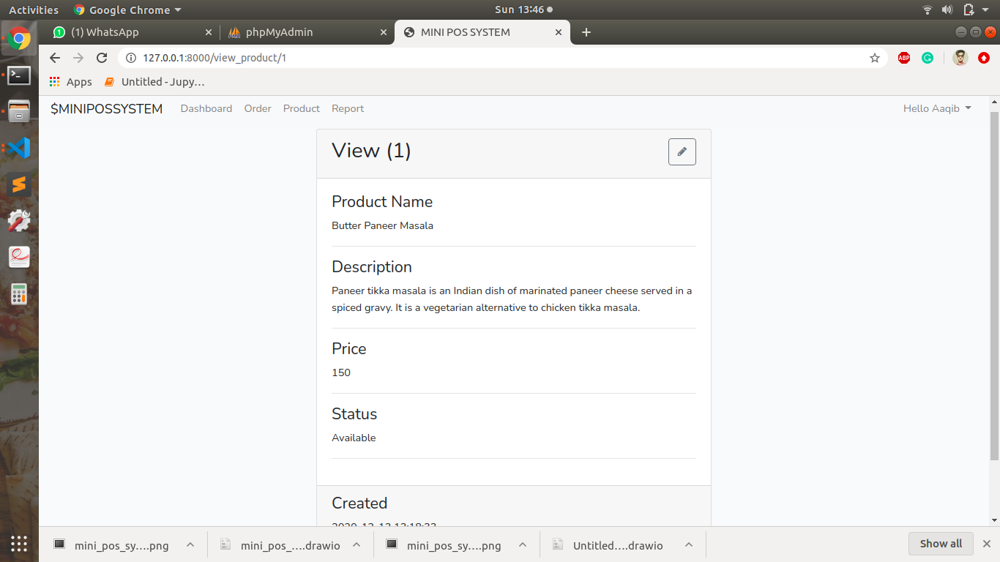

# OBJECTIVE
The Application that I made is MINI POS(point of sale). My objective was to make an application for the restaurant. The features that i have given is auth(login/register/logout), profile, dashboard, product details page, order page and the report page. Also the admin can add the products and the orders according to their needs, its totally CRUD based. Also, one user can order more than one products. In report page, datewise all the sales detail will be there, even admin can select the interval of date and then can see the whole details. 

# TECHNOLOGIES USED
* Frontend: HTML, CSS, Bootstrap 4, jQuery
* Backend: PHP, Laravel
* Database: MySQL

# DATABASE DESIGN

# SNAPSHOTS
* Welcome Page

* Registration Page

* Login Page

* Dashboard Page

* Profile Page

* Logout Page

* Products List

* Add Product Page 

* Edit Product Page 

* View Product Page 

* Delete Product Page

* Orders Page

* Add Order Page

* Edit Order Page 

* View Order Page 

* Delete Order Page

* Report Page

